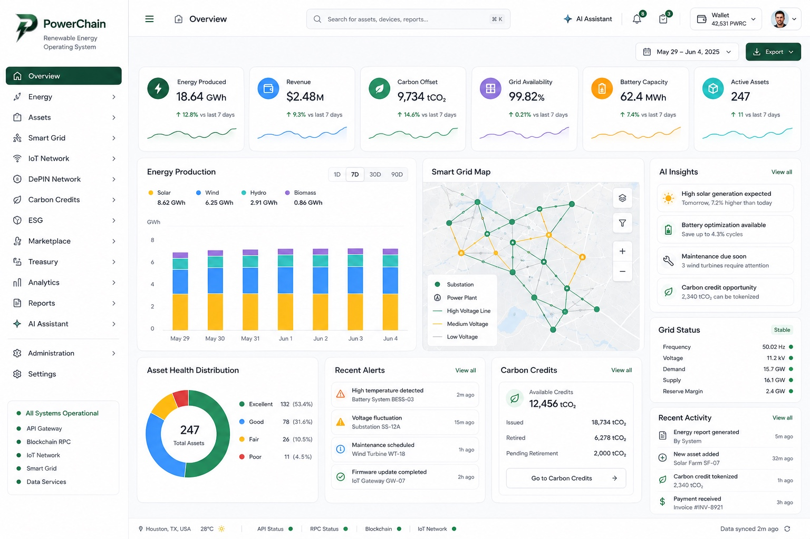

<p align="center">
  
</p>

# PowerChain Platform

<p align="center"><strong>Renewable Energy Intelligence Cloud and Digital Energy Operating System</strong></p>

<p align="center">
  
</p>

## Source architecture

Application code is organized under `src/`. The `@/*` TypeScript alias resolves to `src/*`. UI routes and versioned API route handlers use the Next.js App Router under `src/app`. Shared validation lives in `src/types/validate.ts`; AI contracts live in `src/types/ai/`. Infrastructure, the canonical `prisma/migrations` history, Solana programs, scripts, and public assets remain at the repository root.


## Release

`1.0.0-beta.20.0` introduces the Platform Shell 2.0 authentication experience, responsive sign-in and sign-up screens, supplied PowerChain/PWRC/CCT assets, and a multi-network Web3 wallet abstraction.

## Architecture

- **App Router** for user-facing pages under `src/app/`
- **Route Handlers** for versioned APIs under `src/app/api/v1/`
- `lib/auth/`, `lib/iot/`, and `lib/depin/` contain domain logic; no duplicate root modules
- `config/` contains routes, networks, service status, feature flags, site metadata and breakpoints
- `utils/` contains framework-agnostic helpers, asset resolvers, currency utilities and typed error primitives
- `services/helius/` provides timeout-safe Solana JSON-RPC access
- `programs/` is an Anchor-compatible Rust workspace


### Dashboard workspace modules

Dashboard-specific data and compatibility exports are organized under `lib/workspaces/dashboard/`:

- `assets.ts` — renewable and grid asset catalog
- `auth.ts` — authentication and session exports
- `iot.ts` — IoT domain exports
- `roles.ts` — dashboard roles, capabilities and default destinations
- `security.ts` — security exports

No dashboard domain modules are kept at the repository root.

### Web3 icon strategy

Wallet brands use committed local SVG assets for Phantom, Solflare, Backpack and Glow. Token and network marks resolve local assets first, then approved HTTPS fallbacks from CoinMarketCap or Cryptoicons. Remote image hosts are explicitly allowlisted in `next.config.ts`.


## Documentation

The in-app **References → Documentation** workspace consolidates architecture, APIs, AI agents, token protocols, legal policies and production integration guidance. Source documentation remains under [`docs/`](./docs), while machine-readable OpenAPI is published at [`public/openapi.yaml`](./public/openapi.yaml).

## PWRC Solana integration

PWRC retains the `PWRC` ticker on both the PowerChain native network and Solana. The `wPWRC` ticker is reserved for Sui. The bridge contract enforces the critical invariant that Solana circulating PWRC must never exceed native PWRC locked or escrowed for the Solana integration. See [`contracts/m/pwrc-solana/README.md`](./contracts/m/pwrc-solana/README.md).

## Development

```bash
npm install
npm run validate
npm run typecheck
npm run build
npm run dev
```

Playwright is included through `@playwright/test`. Install browsers once with:

```bash
npx playwright install --with-deps chromium
```

## Solana networks

PowerChain supports `devnet`, `mainnet-beta`, and a user-supplied HTTPS custom RPC. Public RPC defaults are development fallbacks; production deployments should use an authenticated provider such as Helius. Program IDs are configured in `Anchor.toml`, `.env`, and `config/networks.ts`. The included IDs are configuration placeholders until deployment and must be replaced with deployed program addresses.

## User integration settings

Open **Settings → Integrations** to configure a wallet address, cluster, custom RPC, Helius endpoint/API key, or an AI provider/model. Browser-stored secrets are intended for local development only. Production credentials should be encrypted and stored server-side in a managed secrets vault.

## Environment

Copy `.env.example` to `.env.local`. Never commit API keys, private keys, wallet seed phrases, or production RPC credentials.

## Programs

See [`PROGRAMS.md`](./PROGRAMS.md) and [`programs/README.md`](./programs/README.md) for Anchor build, deployment and account-layout guidance.

## Validation

`npm run validate` checks environment configuration, routing, schemas, contracts, OpenAPI, smoke tests and migrations. `npm run build` remains the final release gate.

## Security

PowerChain validates public wallet addresses only and never requests seed phrases or private keys. API keys are redacted from logs. Use server-side proxy endpoints for production AI and RPC usage, enforce tenant authorization, and rotate credentials regularly.

## License

Proprietary beta software unless otherwise stated in individual modules.


### Beta.18 App Router and migration consolidation

- UI routes now use the Next.js App Router under `src/app`.
- `src/pages` was removed.
- Database history is canonical under `prisma/migrations`; duplicate `migration`, `migrations`, and `supabase/migrations` directories were removed.
- Administration UI code is organized under `src/workspaces/admin`.

## Local P2P energy market

PowerChain includes a local peer-to-peer energy workspace at `/p2p-energy`. Consumers, prosumers, and organizations can discover nearby renewable offers, buy local energy, sell surplus production, and rent shared batteries or EV-charging capacity. The implementation includes proximity filters, verified sellers, pricing and network-fee calculations, renewable-energy provenance, carbon estimates, and a wallet-signature order state.

API routes:

- `GET /api/v1/p2p/listings`
- `POST /api/v1/p2p/orders`

Canonical persistence is defined in `prisma/schema.prisma` and `prisma/migrations/20260731190000_p2p_energy`.

## Local P2P energy market

The `/p2p-energy` workspace supports neighbourhood energy buying, prosumer surplus sales, shared battery rentals, and solar EV-charging reservations. Offers expose distance, renewable source, smart-meter verification, available capacity, settlement asset, delivery window, and transparent pricing.

The order lifecycle is designed around metered settlement:

1. The buyer selects an offer and quantity.
2. PowerChain validates availability and pricing.
3. The buyer signs and funds escrow using a supported settlement asset.
4. Smart-meter telemetry confirms delivered energy.
5. Escrow releases to the producer and the order is marked settled.

Relevant endpoints:

- `GET /api/v1/p2p/listings`
- `GET /api/v1/p2p/community`
- `GET|POST /api/v1/p2p/orders`
- `GET|PATCH /api/v1/p2p/orders/:id`

## Distributed Energy Exchange

PowerChain now includes a multi-market Digital Energy Exchange at `/exchange`. It supports renewable energy, storage, EV charging, carbon, certificates, flexibility, capacity and future hydrogen markets through one commercial workspace. The current beta includes typed listings, order-book levels, clearing-price logic, liquidity metrics, live transactions and settlement-state APIs.

Core endpoints:

```text
GET  /api/v1/exchange/dashboard
GET  /api/v1/exchange/listings
POST /api/v1/exchange/listings
GET  /api/v1/exchange/orderbook
GET  /api/v1/exchange/trades
POST /api/v1/exchange/settlements
```

## Smart Meter & Edge Platform

The `/metering/smart-meters` workspace treats meters as trusted edge nodes rather than inventory records. It exposes live energy-flow visualization, electrical measurements, communications health, device status, AI operations guidance and settlement-oriented telemetry foundations.

## Organizations & Participants

The `/organizations/participants` workspace provides one multi-tenant participant model for consumers, prosumers, providers, utilities, aggregators, communities, partners, investors, installers, auditors and regulators. Organizations may hold multiple roles simultaneously.

## Marketplace enterprise architecture

The marketplace now includes a dedicated service and domain layer for participant-aware listing discovery, grid validation, ranking, settlement estimation, and immutable domain events. See `docs/architecture/MARKETPLACE.md` for the full commercial workflow and production boundaries.

Primary endpoints:

- `GET /api/v1/marketplace/dashboard`
- `GET|POST /api/v1/marketplace/listings`
- `GET|POST /api/v1/marketplace/orders`
- `GET /api/v1/marketplace/orderbook`
- `GET /api/v1/marketplace/trades`
- `POST /api/v1/marketplace/settlements`
- `GET /api/v1/marketplace/recommendations`


## Authentication and wallet integration

The reference UI includes responsive email/password sign-in and sign-up, remember-me and password visibility controls, Google and Microsoft entry points, and a Radix-based Web3 wallet modal. Wallet adapters cover injected Solana, Sui and EVM providers, plus validated watch-only public addresses. The application stores only public connection metadata and never requests private keys or recovery phrases.

### Production integration notes

- Replace the demo email/password routes with a production identity provider or hardened server-side authentication service. Enforce verified email, MFA or passkeys, CSRF protection, rate limiting, and tenant-aware session revocation.
- Connect Google and Microsoft buttons to OAuth/OIDC providers with PKCE, strict redirect allowlists, state/nonce validation, and encrypted server-side token storage.
- For Web3 authentication, issue a short-lived server nonce and require the wallet to sign a human-readable challenge. Verify the signature server-side before creating a session; a connected public address alone is not proof of account ownership.
- Keep RPC, Helius, Sui and other provider keys in server-only environment variables or a managed secret vault. Never expose privileged API keys through `NEXT_PUBLIC_*`.
- Persist sessions, wallet links, audit logs and organization memberships in the production database. The in-memory adapters are development fallbacks only.
- Serve PWRC, CCT, wallet and application artwork from the committed `public/` assets or a controlled CDN with integrity and cache policies.
- Validate redirect destinations, enforce HTTPS, use secure HttpOnly SameSite cookies, and review Content Security Policy before deployment.

## Production data and integration notes

PowerChain keeps one canonical Prisma migration history under `prisma/migrations`. Prisma is the typed domain persistence layer, Neon is available for low-latency serverless SQL, and Supabase SSR handles cookie-aware sessions when configured. Secrets, Helius keys, Sui/Solana RPC credentials, Cetus full-node overrides, map-provider tokens, and mail-provider keys must be stored in the deployment secret manager rather than exposed through `NEXT_PUBLIC_*` variables. Vercel deployments can use the included `vercel.json`; Docker deployments use the standalone Next.js output.

## PowerChain AI Platform

PowerChain AI now uses separate workspace packages for model and agent contracts, server-side routing, reusable UI, and fixed-point PWRC credits:

```text
packages/ai-core
packages/ai-gateway
packages/ai-ui
packages/credits
```

The dashboard exposes `/dashboard/ai` workspaces for chat, models, providers, agents, prompts, memory, LoRA adapters, usage, credits, and settings. User-owned API credentials must be encrypted and used only through the server-side gateway. The initial illustrative AI quote is $0.002 per message at a $0.000002 PWRC reference price, equal to 1,000 PWRC. Quotes expire and actual usage is settled separately.
